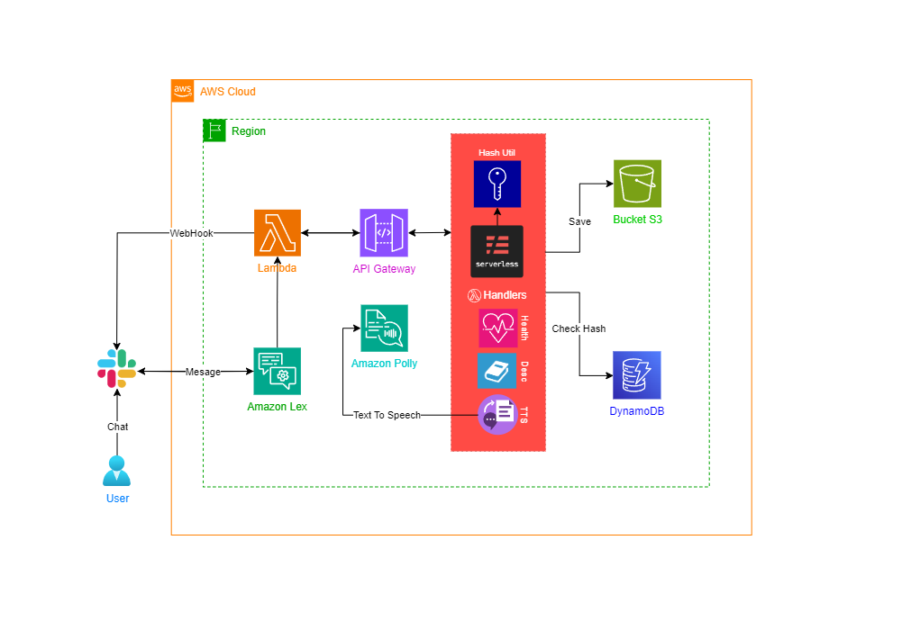
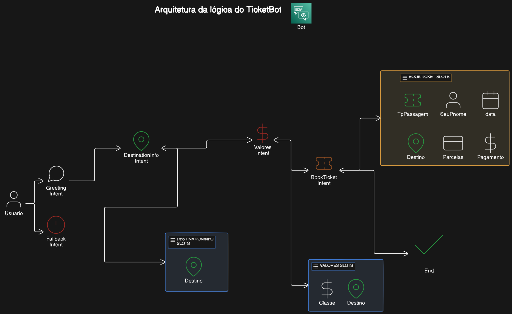

# Chatbot de Reserva de Passagens com API TTS

## 📝 Resumo do projeto

### O Chatbot de Reserva de Passagens integrado ao Slack oferece a funcionalidade adicional de conversão de texto para fala (TTS) através de uma API serverless. Os usuários podem buscar e reservar passagens de viagem diretamente no Slack, recebendo respostas em texto e áudio para uma experiência de usuário mais eficiente.

https://github.com/Compass-pb-aws-2024-MARCO/sprints-6-7-pb-aws-marco/assets/81972850/cbc5f9fe-ec14-4222-ab8a-35b4e5aa867f

## 🔉 API TTS

### Resumo do Desenvolvimento

A API foi desenvolvida com os seguintes componentes e funcionalidades:

1.  **Amazon Polly**: Utilizado para converter frases de texto em arquivos de áudio.

2.  **AWS S3**: Utilizado para armazenar os arquivos de áudio gerados.

3.  **AWS DynamoDB**: Utilizado para registrar os metadados dos arquivos de áudio, garantindo idempotência ao verificar se um áudio já foi gerado para uma frase específica.

4.  **API Serverless**:

- **Recebimento e Validação da Entrada:** Recebe um payload JSON com uma frase e valida a entrada.
- **Geração de ID Único:** Gera um identificador único para a frase utilizando uma função de hash.
- **Verificação de Existência:** Verifica no DynamoDB se o áudio para a frase já existe.
- **Conversão de Texto para Fala:** Converte a frase em áudio usando Amazon Polly.
- **Upload para S3:** Faz upload do áudio gerado para um bucket S3.
- **Registro no DynamoDB**: Registra os metadados do áudio no DynamoDB, incluindo a frase recebida, URL do áudio e data de criação.

| Método | Endpoint                                                 | Descrição        |
| ------ | -------------------------------------------------------- | ---------------- |
| GET    | https://xxxxx.execute-api.us-east-1.amazonaws.com/       | Checar saúde API |
| GET    | https://xxxxx.execute-api.us-east-1.amazonaws.com/v1     | Descrição API    |
| POST   | https://xxxxx.execute-api.us-east-1.amazonaws.com/v1/tts | Text to Speech   |

Formato body JSON esperado para requisição POST:

```
  {
    "phrase": "Frase exemplo para ser transformada em áudio"
  }
```

## 🤖 Chatbot para reserva de pasagens

### Resumo do desenvolvimento

> [!NOTE]
> O chatbot de reserva de passagens de viagem foi desenvolvido com o Amazon Lex e está integrado ao Slack. Possui a funcionalidade de conversão de texto para áudio utilizando a API TTS.

#### Funcionalidades Principais

1.  **Reserva de passagens:** O chatbot permite que os usuários reservem passagens de viagem diretamente pelo Slack, tornando o processo rápido e eficiente.
2.  **Resposta em Áudio:** Além das respostas em texto, o bot oferece a opção baixar o áudio e escutar as respostas através de uma API serverless que converte texto em áudio.

#### Detalhes técnicos

- **Integração com Slack:** O bot está integrado ao Slack, permitindo interação direta dentro do ambiente de trabalho.
- **API Serverless para Conversão de Texto em Áudio:** Utilizamos uma arquitetura serverless para a API de conversão de texto para áudio, garantindo escalabilidade e eficiência.
- **Processo de Desenvolvimento:** O desenvolvimento envolveu a criação de fluxos de diálogo intuitivos entender e responder às solicitações dos usuários de forma precisa.

## 💻 Funcionamento

1. O bot recebe uma mensagem do usuário através do Slack.
2. A mensagem (resposta do bot) é enviada para a nossa API serverless.
3. A API processa a mensagem e a converte em áudio.
4. O link do áudio é então enviado de volta para o bot no Slack por webhook.
5. A opção de escutar o áudio é então disponibilizada no Slack.

---

## 🏛️ Arquitetura do projeto



## 🏛️ Arquitetura do bot Ticket Seller

---

## 🔨 Tecnologias utilizadas

- Python : Ferramenta usada em conjunto com Serverless e Lambda.
- Serverless Framework: Para a criação e gestão da API.
- AWS Lambda: Invocado por codehooks para consumir API TTS e enviar webhooks para Slack.
- AWS Polly: Para a conversão de texto em áudio.
- Amazon Lex: Para criação do chatbot.
- Slack: Para a implementação do Chatbot.

---

## 📌 Como executar a aplicação

#### Serverless API TTS

- Navegue até o diretório da API executando: `cd api`.

- No arquivo _serverless.yml_ modifique as variáveis `DYNAMODB_TABLE` e `S3_BUCKET` com seus respectivos nomes para a table e bucket.

> [!WARNING]
> Se atente durante a criação do Bucket S3 quanto às permissões de leitura dos objetos e à visibilidade pública do bucket. Os usuários no Slack conseguem ter acesso ao áudio convertido pela API TTS somente se os objetos do bucket tenham acesso público o que contraria as recomendações da AWS quanto ao public access.

- Instale a framework serverless `npm install -g serverless`.

- Configure as credenciais AWS gerenciadas pelo IAM:

  ```
  $ aws configure
  AWS Access Key ID [None]: ACCESSKEYEXAMPLE
  AWS Secret Access Key [None]: SECRETKEYEXAMPLE
  Default region name [None]: us-east-1
  Default output format [None]: ENTER
  ```

- Execute o comando `serverless deploy`.

> [!CAUTION]
> As credenciais devem ficar apenas localmente no seu ambiente. Nunca exponha as crendenciais no Readme ou qualquer outro ponto do código.

#### Chatbot Amazon LexV2

- Importe o arquivo zip presente no diretório `/bot` para o Amazon Lex.

#### Lambda Code Hook

- Crie uma nova função lambda na AWS, importe o arquivo libs.zip presente no diretório `/aws` e adicione o arquivo `lambda_function.py` na raíz do lambda.

- Vincule a função criada no Amazon Lex como função a ser invocada em casos de Fulfillment.

> [!IMPORTANT]
> Aumente o timeout da função Lambda acessando as configurações gerais e modifique para 5 segundos. Lembre-se de garantir as permissões necessárias de leitura ao bucket S3 pelo IAM role respectivo à lambda function.

## 👨‍💻 Desenvolvedores

- [Adelson Teodoro](https://github.com/imrooteodoro)
- [Giovane Iwamoto](https://github.com/GiovaneIwamoto)
- [Gustavo Vasconcelos](https://github.com/GustavoSVasconcelos)

## ❓ Dificuldades no desenvolvimento

Uma das dificuldades da equipe foi no desenvolvimento do chatbot, pois nunca tínhamos tido contato com a interface do Amazon Lex. Por isso, levamos um tempo para entender como criar cada intent e utilizar os slots de forma eficiente. Além disso, a maior dificuldade foi na integração da API com o Lex.
